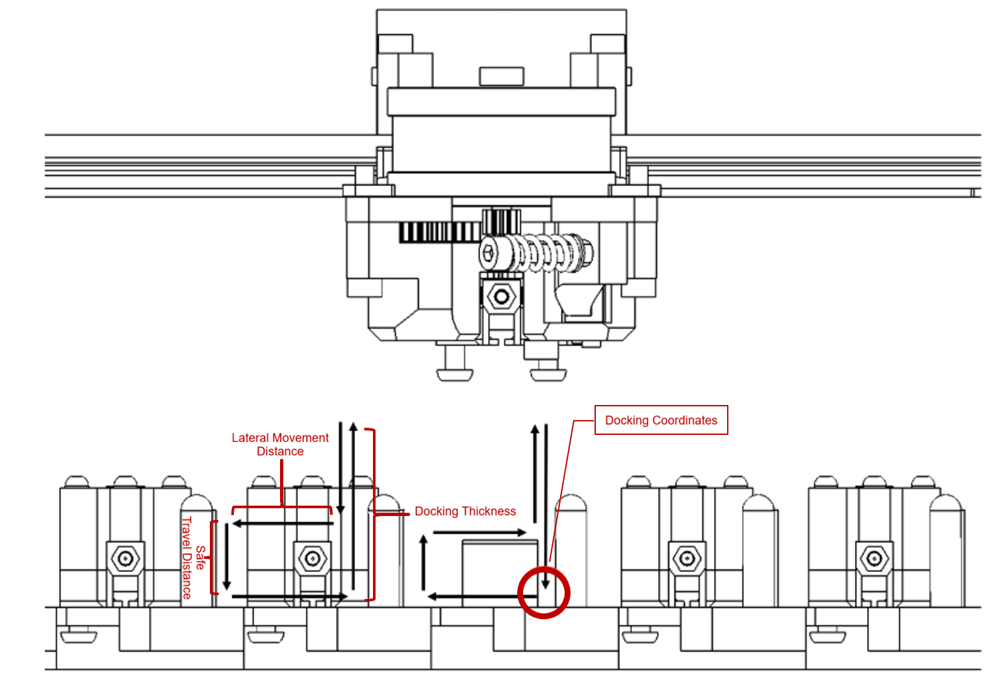

# [CxChanger]

> **Attribution / Credit**: Initial translation courtesy of [WheelsTheCat](https://github.com/WheelsTheCat/CxChanger). Translated content includes the README, Klipper configuration comments/messages, BOM spreadsheet, file names. For a translated STEP file refer to his repository.

[CxChanger] is a multi-material / multi-color solution for FDM 3D printing. It achieves fast multi-material printing by switching between preheated hotends loaded with different filaments during the print. The goal is multi-material printing that is as low-cost, simple, and stable as possible. For high adaptability, hotend switching only requires XY-axis motion of the print head, and the switching mechanism is independent of the hotend itself — other hotends can be made compatible by modifying the hotend mounting parts.


---

## Core Features
- **Automatic preheating**: With the Ooze Prevention feature enabled in OrcaSlicer, preheat commands are inserted before each material change according to your configured preheat time. During a switch, the old hotend is released and set to standby temperature, and the already-preheated hotend is picked up. If the time until the next switch is shorter than the heating time, the temperature is held without cooling down.
- **Underactuated switching mechanism**: The underactuated design requires no additional active components. It uses the print head's own XY-axis motion interacting mechanically with the dock to perform hotend switching and filament clamping/releasing.
- **Magnetic Maxwell kinematic coupling**: The hotend module is locked using N52 magnets combined with a [Maxwell coupling](https://en.wikipedia.org/wiki/Kinematic_coupling) locating mechanism. The print head side has three grooves formed by locating pins, and the hotend module side has ball ends formed by round-head pin tips. When magnetically coupled, all six spatial degrees of freedom of the hotend module are constrained. Because there is no over-constraint, the hotend module can self-adaptively compensate for backlash and locate precisely even with machining/assembly errors, wear, and deformation.
- **Automatic nozzle offset calibration**: A calibrator measures each head's XYZ offset relative to T0. You can use, for example, [ball-probe contact nozzle offset calibration](https://github.com/Noisyfox/FoxChanger/tree/main/NozzleProbe) or [non-contact eddy-current nozzle offset calibration](https://oshwhub.com/cxg01/project_lbabffjk). Contact calibration requires a clean nozzle for correct offsets; non-contact does not. Calibration is not needed before every print — it is typically only required after initial assembly or after events such as a head crash.

## Hardware and Software Requirements

### Hardware
* **Printer**: In principle, any machine whose print head can move in XY is supported (e.g., Voron 2.4, Voron Trident, BIQU/BigTreeTech, etc.). This open-source project only provides the print head and basic dock designs; you will need to adapt the aluminum extrusion mounting for the dock and make other compatibility modifications for your machine.
* **Main board**: Since wired heating is used, each hotend module has its own heater and thermistor. Spare ports on the main board can be used to add a small number of hotend modules. To add more, build an [expansion board](https://oshwhub.com/rayzark/project_qxihkkhj) to increase the number of heater and thermistor ports.

### Software
* **Firmware**: Hotend switching is implemented entirely through Klipper macros. If you want to use nozzle offset calibration, install the [toolchanger](https://github.com/viesturz/klipper-toolchanger) plugin and use it together with the automatic calibration macros.
* **Slicer**: OrcaSlicer is used; other slicers can be explored on your own.

## System Overview

### Components
- Print head: everything except the hotend
- Hotend module: contains the hotend, with PTFE tube and heater/thermistor wiring attached
- Dock: stores parked hotends. It plugs the nozzle of a parked hotend to prevent oozing, and has cooling fans for the parked hotends (open-frame machines use a side centrifugal fan cooling all hotends; enclosed machines use one axial fan per dock).

### Parts
#### Printed version
- 1.5×5 (diameter×length) cylindrical pins: form the grooves of the Maxwell coupling (×6)
- 3×6 (diameter×length) round-head pins: form the balls of the Maxwell coupling (3 per hotend)
- 5×20 (diameter×length) internally threaded round-head pin: mounted on the dock to spread open the extruder swing arm (1 per dock)
- 6×4 (diameter×thickness) N52 magnets: attach the hotend module to the print head and dock (3 per hotend, 1 per dock, 3 on the print head)
- M3×6 countersunk screws
- M3×25 screws
- M3×8 screws
- M3×10 screws
- M3×12 screws
- M3×14 screws
- M3×20 screws
- M2.5×16 screws
- M2×8 screws
- M3×4×4 heat-set inserts
- HGX extruder gear set
- 4020 blower fan
- 2510 axial fan
- Omron micro switch
- 10×2 (width×thickness) self-adhesive heat-resistant silicone strip
#### CNC version
See the BOM sheet

## Installation and Configuration Guide

### printer.cfg
   You can keep using your existing printer.cfg as the base. Modify it following the format in my printer.cfg and the notes below, or use mine directly and change the pins to match your board.
   1. Include toolchange.cfg and calibration.cfg.
   2. Define the additional hotends following the extruder1 format. Wire the heater and thermistor pins according to your board. They share E0's extruder motor; the others are virtual extruders.
   3. The probe uses a fixed micro switch. At print start, all hotends are parked in the dock with their nozzles plugged by the high-temperature silicone pads, and are only picked up once heated to the target temperature — this solves the initial oozing problem, and no nozzle wiping is needed. During leveling no hotend is attached, so the micro switch is the lowest point of the print head. Other leveling methods are not yet supported; it is recommended to use my probe-related configuration directly, including the bed mesh and leveling configuration (mainly the addition of releasing the grabbed hotend before leveling).
   4. Add the dock cooling fan configuration, and add all extruders to the extruder association of the dock cooling fan and the heatbreak cooling fan.
   5. Modify the print start G-code to automatically prime (extrude a line with) each hotend that will be used before printing.
   6. Modify the print end G-code to add the UNTOOL command so the hotend is automatically unloaded after printing, avoiding manual removal before the next print. Add commands to turn off all hotend heaters.
### toolchange.cfg
   1. Add toolchange.cfg. Once added successfully, T0, T1, T2 and UNTOOL commands will appear in the dashboard. (Do not click them before setting the coordinates — it will crash the head.) Clicking T0 picks up T0; after picking up T0, clicking T1 automatically unloads T0 and picks up T1; clicking UNTOOL unloads the current hotend.
   2. Mount the dock and adjust the dock coordinates: manually attach a hotend to the print head, move the print head to the far right of the X axis, then move it forward. Fix the first dock in the position where the hotend locking screw just passes through the dock's large hole (this position is the coordinate of the first dock). Then remove the hotend, home all axes, re-attach the hotend to the print head, and slowly move the print head to the dock position you just found so the locking screw passes through the dock's large hole. Note the coordinates and enter them as T0's dock position in toolchange.cfg. Each dock occupies 30 mm of width, so the other dock coordinates form an arithmetic sequence; fine-tune each dock's coordinates if there is any error.
   

   
   3. After setting the coordinates correctly, comment out the normal speed and uncomment the test speed, then run switching tests at slow speed (so you can hit emergency stop immediately if anything is misaligned).
   4. Once switching works at test speed, comment out the test speed and uncomment the normal speed (you can test and tune more suitable speeds for your own machine).
### calibration.cfg
   1. Download the [toolchanger](https://github.com/viesturz/klipper-toolchanger) plugin
   1. Add calibration.cfg
   2. Home XYZ. After leveling completes, mount the calibrator, click T0 to pick up the first hotend, and move it until the nozzle tip is directly above the center of the calibrator at a distance of about 1 mm. Note the coordinates and enter them as the calibrator coordinates in calibration.cfg. You also need to define a safe position outside the dock area in the file, to avoid hitting the other hotends in the dock during calibration.
   3. Once the coordinates are set, run CALIBRATE_TOOL TOOL=_ to calibrate a specific hotend (T0 must be calibrated first), or CALIBRATE_ALL_TOOLS to calibrate all of them (set which hotends exist first). Offsets are stored automatically when calibration completes.
### orcaslicer
   1. In the printer G-code, modify the start G-code and the filament change G-code; configure additional extruders (according to your number of hotends); set the retraction amount for each extruder when switching filament (I use 2 mm).
- Print start G-code (modify according to your number of hotends):
```Gcode
PRINT_START BED=[first_layer_bed_temperature] INITIAL_TOOL=[initial_tool] T0_TEMP={nozzle_temperature_initial_layer[0]} T0_USED={is_extruder_used[0]} T1_TEMP={nozzle_temperature_initial_layer[1]} T1_USED={is_extruder_used[1]} T2_TEMP={nozzle_temperature_initial_layer[2]} T2_USED={is_extruder_used[2]} T3_TEMP={nozzle_temperature_initial_layer[3]} T3_USED={is_extruder_used[3]} T4_TEMP={nozzle_temperature_initial_layer[4]} T4_USED={is_extruder_used[4]}
```
- Filament change G-code:
```Gcode
M104 S{nozzle_temperature[next_extruder]} T{next_extruder}
T{next_extruder}
```
   2. In the Process settings, enable the wipe tower (if your filament and settings are well tuned and the model does not involve fast tiny extrusions, you can move the model next to the dock, disable the wipe tower, and try printing without one) and enable Ooze automatic preheating (I use a softening temperature offset of -180 and a preheat time of 35 s; adjust for your hotend's heating speed).


## Notes
- Printed parts should be printed in ABS with 4 walls and 60% infill.
- The extruder spring must be tightened more than on a regular extruder (to save space the lever arm is limited, so at the same preload the clamping force is lower than a normal extruder).
- To reduce heat conduction, the TZ2.0 hotend used here needs the two screws that fix the heater block removed, holding it only with the side set screw.
- Install the magnets exactly as shown in the drawings (some are pressed fully in, some are flush with a face). When assembled correctly, only the round-head pins on the hotend module side touch the cylindrical-pin grooves on the back plate side, with a small gap between the magnets — this enables the automatic backlash compensation of the Maxwell coupling. Wiggle the hotend to check for play; if there is play, check the installation. If print accuracy degrades during printing, check the locating assembly — a common issue is a magnet coming loose, sliding out, and contacting the magnet on the other side, which defeats the Maxwell coupling.
- The hook screws on the hotend module that hang in the dock holes should be grade 12.9 cap-head screws so they are attracted by the magnets in the dock; 304 stainless steel screws will not be attracted properly.
